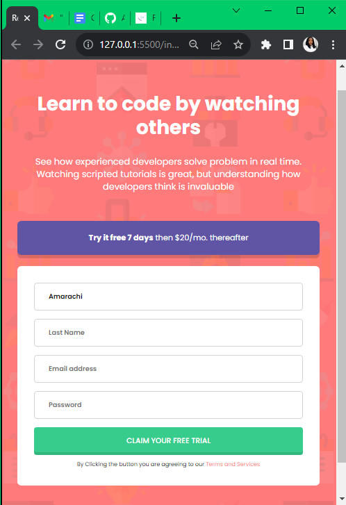

# Frontend Mentor - Intro component with sign up form solution

This is a solution to the [Intro component with sign up form challenge on Frontend Mentor](https://www.frontendmentor.io/challenges/intro-component-with-signup-form-5cf91bd49edda32581d28fd1).

## Table of contents

- [Overview](#overview)
  - [The challenge](#the-challenge)
  - [Screenshot](#screenshot)
  - [Links](#links)
- [My process](#my-process)
  - [Built with](#built-with)
  - [What I learned](#what-i-learned)
  - [Continued development](#continued-development)
  - [Useful resources](#useful-resources)
- [Author](#author)
- [Acknowledgments](#acknowledgments)

## Overview

### The challenge

Users should be able to:

- View the optimal layout for the site depending on their device's screen size
- See hover states for all interactive elements on the page
- Receive an error message when the `form` is submitted if:
  - Any `input` field is empty. The message for this error should say _"[Field Name] cannot be empty"_
  - The email address is not formatted correctly (i.e. a correct email address should have this structure: `name@host.tld`). The message for this error should say _"Looks like this is not an email"_

### Screenshot




### Links

- Solution URL: [Add solution URL here](https://github.com/Amarajack/Signupform)
- Live Site URL: [Add live site URL here](https://your-live-site-url.com)

## My process

I started this project by writing the HTML and CSS styling

### Built with

- Semantic HTML5 markup
- CSS media queries
- Flexbox

### What I learned

I practiced my knowledge of html, media queries and css in building a responsive signup form, i also learnt how to use CSS selectors and pseudo element and also how to use the flex box to create a responsive design.

```html
<div class="input-box">
	<input type="text" required placeholder="First Name" />
	<span>First Name cannot be empty</span>
</div>
```

```css
.input-box input:focus:invalid + span {
	display: block;
}
.input-box input:focus {
	border: 1px solid hsl(248, 32%, 49%);
}
```

### Continued development

I would love to focus on the CSS styling part of different projects i intend to work on in the future.

### Useful resources

- [pseudo-element](https://developer.mozilla.org/en-US/docs/Web/CSS/Pseudo-elements) - This helped me to understand how to use the peudo elements and I really liked this pattern and will use it going forward.
- [css media queries](https://www.google.com/search?q=css+breakpoints&oq=css+breakpoint&gs_lcrp=EgZjaHJvbWUqBwgAEAAYgAQyBwgAEAAYgAQyBggBEEUYOTIHCAIQABiABDIHCAMQABiABDIHCAQQABiABDIHCAUQABiABDIHCAYQABiABDIHCAcQABiABDIHCAgQABiABDIHCAkQABiABNIBCDYzOThqMGo3qAIAsAIA&sourceid=chrome&ie=UTF-8) - This is an amazing article which helped me finally understand media queries. I'd recommend it to anyone still learning this concept.

## Author

- Frontend Mentor - [@Amarajack](https://www.frontendmentor.io/profile/Amarajack)
- LinkedIn - [Amarachi Jack](https://www.linkedin.com/in/amarachi-jack-654680165)


## Acknowledgments

I want to appreciate my mentor @princessmaggy for her apts, explanatory coaching and encouragement during the process of my training. I'm so glad to have learned all that I have and I look forward to learning more. Thank you coach for your resilience.

